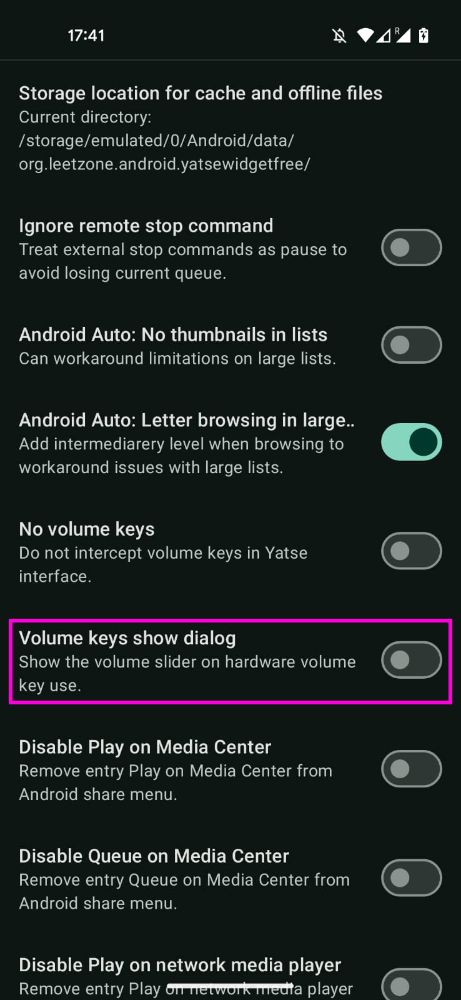

# 🎵 Yatse Beocreate plugin API 🎚️

> This plugin is not affiliated to Yatse or its author Tolriq / Genimee.
>
> Please request support directly from the author of this plugin : [Here](https://github.com/vincss/yatse-beocreateplugin-api/issues)

This is plugin can be used with [Yatse](https://yatse.tv/) to control the soundboard [HifiBerry Beocreate](https://www.hifiberry.com/beocreate/) on top of a Raspberry Pi.  .

## 📜 HowTo

The app has been made to work with the [dsptoolkit](https://github.com/hifiberry/hifiberry-dsp/) installed on top of [OSMC](https://osmc.tv/) .

## **⚠️** 
There is a race condition when starting the Yatse remote, the volume is at 100% : https://community.yatse.tv/t/dev-plugin-for-beocreate/4538/16?u=vincs

You should disable the volume pop-up in the Advanced settings :

